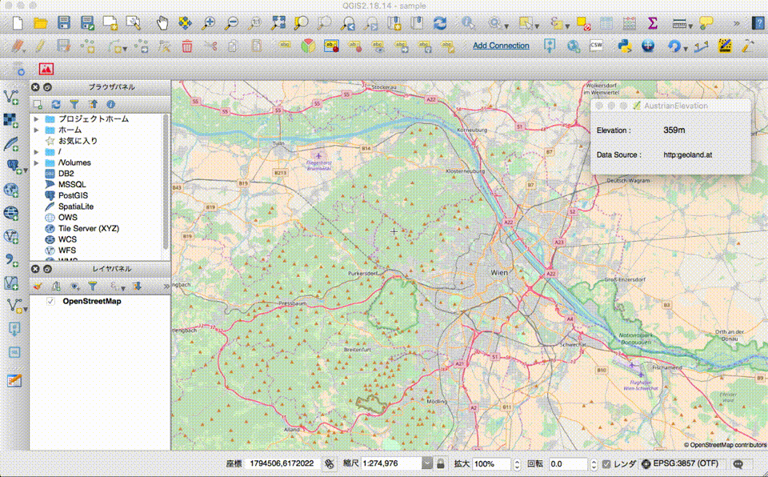

# AustrianElevation (Austrian Version of JapanElevation)

Display elevation value of specified position on QGIS. (QGISv2)  
Using [Austrian Elevation Service](https://www.egger-gis.at/special-gis-tools/austrian-elevation-service/) by Manfred Egger.  

 

## Usage

- Click "AustrianElevation".
- Click the designated position to display the elevation value.

 

## License
Python modules are released under the GNU General Public License v2.0

Copyright (c) 2018 Yasunori Kirimoto

 

---

 

### Japanese

 

# 標高値取得 (JapanElevationのオーストリア版)

QGISで指定位置の標高値を表示 (QGISv2)  
Manfred Eggerさんの[Austrian Elevation Service](https://www.egger-gis.at/special-gis-tools/austrian-elevation-service/)を利用

 

##  使用方法

- AustrianElevationボタンクリック  
- 指定位置クリックで標高値表示  

 

## ライセンス
Python modules are released under the GNU General Public License v2.0

Copyright (c) 2018 Yasunori Kirimoto

 

---
